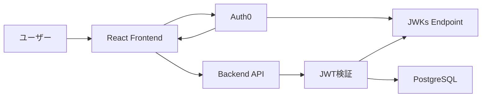

# Auth0認証実装計画

## 概要
FinanceTrackerにAuth0を使用した認証機能を実装するための詳細計画です。
フロントエンド（React）、バックエンド（Gin）、インフラストラクチャ全体にわたる認証実装を行います。

## 実装フロー概要


## Phase 1: Auth0セットアップ

### 1.1 Auth0テナント作成
- [ ] Auth0アカウント作成
- [ ] 開発用テナント作成（region: 日本）
- [ ] テナント設定
  - [ ] テナント名設定
  - [ ] デフォルトディレクトリ設定

### 1.2 アプリケーション登録
- [ ] SPA（Single Page Application）作成
  - [ ] アプリケーション名: FinanceTracker Web
  - [ ] Allowed Callback URLs: http://localhost:5173/callback
  - [ ] Allowed Logout URLs: http://localhost:5173
  - [ ] Allowed Web Origins: http://localhost:5173
  - [ ] Allowed Origins (CORS): http://localhost:5173
- [ ] API作成
  - [ ] API名: FinanceTracker API
  - [ ] Identifier (Audience): https://api.financetracker.local
  - [ ] Signing Algorithm: RS256
  - [ ] スコープ定義
    - read:profile
    - write:profile
    - read:transactions
    - write:transactions
    - read:accounts
    - write:accounts

### 1.3 ルール・アクション設定
- [ ] Actionsでユーザーメタデータ追加
  - [ ] ユーザーID同期
  - [ ] 権限情報付与
- [ ] メールテンプレートカスタマイズ
  - [ ] ウェルカムメール
  - [ ] パスワードリセット

### 1.4 環境変数設定
```env
# Backend (.env)
AUTH0_DOMAIN=your-tenant.auth0.com
AUTH0_AUDIENCE=https://api.financetracker.local
AUTH0_CLIENT_ID=your-api-client-id
AUTH0_CLIENT_SECRET=your-api-client-secret

# Frontend (.env)
VITE_AUTH0_DOMAIN=your-tenant.auth0.com
VITE_AUTH0_CLIENT_ID=your-spa-client-id
VITE_AUTH0_REDIRECT_URI=http://localhost:5173/callback
VITE_AUTH0_AUDIENCE=https://api.financetracker.local
```

## Phase 2: バックエンド実装

### 2.1 依存関係追加
```go
// go.mod
github.com/auth0/go-jwt-middleware/v2
github.com/square/go-jose/v3
```

### 2.2 認証基盤実装
- [ ] `internal/infrastructure/auth0/client.go`
  - [ ] Auth0クライアント実装
  - [ ] JWKs取得・キャッシュ機能
  - [ ] トークン検証機能
- [ ] `internal/infrastructure/auth0/middleware.go`
  - [ ] JWT検証ミドルウェア改修
  - [ ] スコープ検証
  - [ ] ユーザー情報抽出

### 2.3 認証エンドポイント実装
- [ ] `internal/interface/handler/auth_handler.go`
  ```go
  // POST /auth/login - フロントエンドからのログイン要求処理
  // POST /auth/logout - ログアウト処理
  // GET /auth/callback - Auth0コールバック処理
  // GET /auth/user - 現在のユーザー情報取得
  ```

### 2.4 ユーザー同期サービス
- [ ] `internal/application/service/auth_service.go`
  - [ ] Auth0ユーザー情報取得
  - [ ] DBユーザー作成・更新
  - [ ] 権限同期

### 2.5 セキュリティ実装
- [ ] CSRF対策
- [ ] Rate Limiting
- [ ] セキュアなCookie設定

## Phase 3: フロントエンド実装

### 3.1 Auth0 React SDK導入
```bash
npm install @auth0/auth0-react
```

### 3.2 認証プロバイダー設定
- [ ] `src/providers/AuthProvider.tsx`
  ```tsx
  import { Auth0Provider } from '@auth0/auth0-react';
  
  export const AuthProvider: React.FC<{ children: React.ReactNode }> = ({ children }) => {
    return (
      <Auth0Provider
        domain={import.meta.env.VITE_AUTH0_DOMAIN}
        clientId={import.meta.env.VITE_AUTH0_CLIENT_ID}
        redirectUri={import.meta.env.VITE_AUTH0_REDIRECT_URI}
        audience={import.meta.env.VITE_AUTH0_AUDIENCE}
        scope="read:profile write:profile"
      >
        {children}
      </Auth0Provider>
    );
  };
  ```

### 3.3 認証コンポーネント実装
- [ ] `src/components/auth/LoginButton.tsx`
- [ ] `src/components/auth/LogoutButton.tsx`
- [ ] `src/components/auth/UserProfile.tsx`
- [ ] `src/pages/Callback.tsx` - コールバックページ

### 3.4 認証ガード実装
- [ ] `src/components/auth/ProtectedRoute.tsx`
  ```tsx
  import { withAuthenticationRequired } from '@auth0/auth0-react';
  
  export const ProtectedRoute: React.FC<{ component: React.ComponentType }> = ({ 
    component,
    ...args 
  }) => {
    const Component = withAuthenticationRequired(component, {
      onRedirecting: () => <LoadingScreen />
    });
    return <Component {...args} />;
  };
  ```

### 3.5 APIクライアント改修
- [ ] `src/lib/api/client.ts`
  - [ ] トークン自動付与
  - [ ] 401エラーハンドリング
  - [ ] トークンリフレッシュ

## Phase 4: インフラストラクチャ設定

### 4.1 Docker Compose設定
- [ ] 環境変数追加
- [ ] ボリューム設定（証明書用）
- [ ] ネットワーク設定

### 4.2 開発環境HTTPS設定
- [ ] mkcertでローカル証明書生成
- [ ] Nginxリバースプロキシ設定
- [ ] フロントエンド・バックエンドHTTPS対応

### 4.3 本番環境準備
- [ ] Production環境のAuth0アプリ作成
- [ ] 環境別設定ファイル
- [ ] シークレット管理

## Phase 5: テスト実装

### 5.1 単体テスト
- [ ] 認証ミドルウェアテスト
- [ ] JWTモック作成
- [ ] 認証サービステスト

### 5.2 統合テスト
- [ ] 認証フローE2Eテスト
- [ ] API認証テスト
- [ ] 権限ベースアクセステスト

### 5.3 セキュリティテスト
- [ ] ペネトレーションテスト
- [ ] OWASP準拠確認
- [ ] 脆弱性スキャン

## 実装順序

1. **Auth0セットアップ** (1日)
   - テナント・アプリケーション作成
   - 環境変数設定

2. **バックエンド基本実装** (2日)
   - JWKs取得・キャッシュ
   - JWT検証ミドルウェア完成
   - 認証エンドポイント

3. **フロントエンド基本実装** (2日)
   - Auth0 Provider設定
   - ログイン/ログアウト機能
   - 認証ガード

4. **統合・テスト** (1日)
   - E2Eフロー確認
   - バグ修正
   - ドキュメント作成

## セキュリティチェックリスト

- [ ] HTTPSの強制
- [ ] セキュアなCookie設定（HttpOnly, Secure, SameSite）
- [ ] CORS設定の厳格化
- [ ] Rate Limiting実装
- [ ] SQL Injection対策
- [ ] XSS対策
- [ ] CSRF対策
- [ ] 最小権限の原則
- [ ] 監査ログ実装
- [ ] セッション管理

## トラブルシューティング

### よくある問題
1. **CORS エラー**
   - Auth0アプリケーションのAllowed Originsを確認
   - バックエンドのCORS設定確認

2. **Invalid Token エラー**
   - Audience設定の一致確認
   - JWKsエンドポイントへのアクセス確認
   - トークンの有効期限確認

3. **ユーザー同期エラー**
   - Auth0 Management APIの権限確認
   - DBスキーマとの整合性確認

## 参考資料

- [Auth0 React SDK Quickstart](https://auth0.com/docs/quickstart/spa/react)
- [Auth0 Go SDK Documentation](https://github.com/auth0/go-jwt-middleware)
- [JWT Best Practices](https://tools.ietf.org/html/rfc8725)
- [OWASP Authentication Cheat Sheet](https://cheatsheetseries.owasp.org/cheatsheets/Authentication_Cheat_Sheet.html)